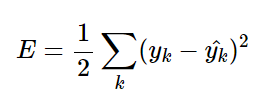
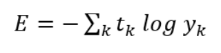

# 4. 신경망 학습  

## 4.1 데이터에서 학습한다!  
* 신경망의 특징은 데이터를 보고 학습할 수 있다  
* 데이터에서 학습한다는 것은 가중치 매개변수의 값을 데이터를 보고 자동으로 결정한다는 뜻  

### 4.1.1 데이터 주도 학습  
* 기계학습은 데이터가 생명  
* 일반적으로 어떤 문제를 해결하려 할 때, 사람이 이것저것 생각하고 답을 찾는 것이 일반적  
* 기계학습에서는 사람의 개입을 최소화!!  
* 신경망과 딥러닝은 기존 기계학습에서 사용하던 방법보다 사람의 개입을 더욱 배재할 수 있음  
* 손글씨 이미지를 보고 5인지 인식하는 경우  
    * 이미지에서 특징을 추출(변환기 이용)  
    * 이미지 데이터를 벡터로 변환하고 SVM,KNN 등으로 학습  
* 특징과 기계학습을 활용한 접근에도 문제에 따라서는 사람이 적절한 특징을 생각해내야 함  
* 신경망의 경우 이미지에 포함된 중요한 특징까지 기계가 스스로 학습함  
* 딥러닝을 end-to-end machine learning(종단간 기계학습)이라고 함
* 신경망은 모든 문제를 주어진 데이터 그대로를 입력 데이터로 활용해 end-to-end로 학습할 수 있음  

### 4.1.2 훈련 데이터와 시험 데이터  
* 기계학습 문제는 데이터를 training data와 test data로 나눠 학습과 실험을 수행하는 것이 일반적  
* 훈련 데이터만 사용하여 최적의 매개변수를 찾고 시험 데이터를 이용하여 모델을 평가  
* 나누는 이유? 우리가 원하는 모델은 범용적으로 사용할 수 있는 모델이기 때문  
* 한 데이터셋에만 지나치게 최적화된 상태를 오버피팅이라고 함  
* 오버피팅을 피하는 것이 기계학습의 중요한 과제이기도 함  

## 4.2 손실 함수  
* 신경망 학습에서는 현재의 상태를 하나의 지표로 표현함  
* 신경망 학습에서 사용하는 지표는 손실 함수라고 함  
* 손실 함수는 임의의 함수를 사용할 수 있지만 일반적으로 오차제곱함과 교차 엔트로피 오차를 사용  

### 4.2.1 오차제곱함  
* 가장 많이 쓰이는 손실 함수는 오차제곱함  

* 2를 나누는 이유는 델타 규칙 떄문  
    * 오류를 최소화시키기 위해서  

### 4.2.2 교차 엔트로피 오차  
  
* 교차 엔트로피 오차는 정답일 때의 출력이 전체 값을 정하게 됨  

### 4.2.3 미니배치 학습  
* MNIST 데이터셋은 훈련 데이터가 60000개  
* 모든 데이터를 대상으로 손실 함수의 합을 구하려면 시간이 걸림  
* 훈련 데이터로부터 일부만 골라 학습을 수행 이를 미니배치라고 함  

### 4.2.5 왜 손실 함수를 설정하는가?  
* 정확도라는 지표를 놔두고 손실 함수의 값이라는 우회적인 방법을 택하는 이유?  
* 신경망 학습에서 '미분'의 역할에 주목하면 해결됨  
* 신경망 학습에서는 최적의 매개변수를 탐색할 때 손실 함수의 값을 가능한 작게 하는 매개변수 값을 찾음  
* 매개변수의 미분을 계산하고 그 미분 값을 단서로 매개변수의 값을 서서히 갱신하는 과정을 반복함  
* 미분 값이 0이면 가중치 매개변수의 갱신은 거기서 멈춤  
* 정확도를 지표로 삼아서는 안 되는 이유는 미분 값이 대부분의 장소에서 0이 되어 매개변수를 갱신할 수 없기 때문  
* 한 신경망이 100장 중 32장을 올바르게 인식한다고 가정할 때 매개변수 값을 조금 바꾼다고 해도 정확도는 그래도 32%일 것  
* 즉 정확도는 매개변수의 작은 변화에는 거의 반응을 보이지 않고 반응이 있더라고 그 값이 불연속적으로 갑자기 변함  

## 4.4 기울기  
* 모든 변수의 편미분을 벡터로 정리한 것을 기울기라고 함  
* 기울기는 각 지점에서 낮아지는 방향을 가리킴  
* 기울기가 가리키는 쪽은 각 장소에서 함수의 출력 값을 가장 크게 줄이는 방향  

### 4.4.1 경사법(경사 하강법)  
* 기울기를 잘 이용해 함수의 최솟값(가능한 작은 값)을 찾으려는 것이 경사법  
* 주의점: 각 지점에서 함수의 값을 낮추는 방안을 제시하는 지표가 기울기  
* 그러나 기울기가 가리키는 곳에 정말 함수의 최솟값이 있는지 보장할 수 없음  
* 경사법은 현 위치에서 기울어진 방향으로 일정 거리만큼 이동  
* 그런 다음 이동한 곳에서도 기울기를 구하고, 기울어진 방향으로 나아가기를 반복  
* 이렇게 해서 함수의 값을 점차 줄이는 것이 경사법  
* 학습률: 한번의 학습으로 얼마만큼 학습해야 할지, 매개변수의 값을 얼마나 갱신하느냐를 정하는 것이 학습률  
* 학습률이 너무 크거나 작아도 좋은 장소를 찾아갈 수 없음  
* 학습률이 너무 크면 너무 큰 값으로 발산할 수 있고, 너무 작으면 거의 갱신되지 않고 끝나버릴수 있음  
* 학습률과 같은 매개변수를 하이퍼파라미터라고 하고 보통 사람이 직접 설정해야하는 매개변수  

## 4.6 정리  
* 기계학습에서 사용하는 데이터셋은 훈련 데이터와 시험 데이터로 나눠 사용  
* 훈련 데이터로 학습한 모델의 범용 능력을 시험 데이터로 평가함  
* 신경망 학습은 손실 함수를 지표로, 손실 함수의 값이 작아지는 방향으로 가중치 매개변수를 갱신함  
* 가중치 매개변수를 갱신할 때는 가중치 매개변수의 기울기를 이용하고, 기울어진 방향으로 가중치의 값을 갱신하는 작업을 반복함  
* 수치 미분을 이용한 계산에는 시간이 걸리지만, 구현이 간단함  
* 오차역전파법은 기울기를 고속으로 구할 수 있음  