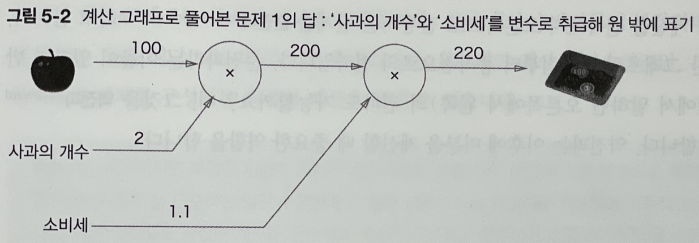
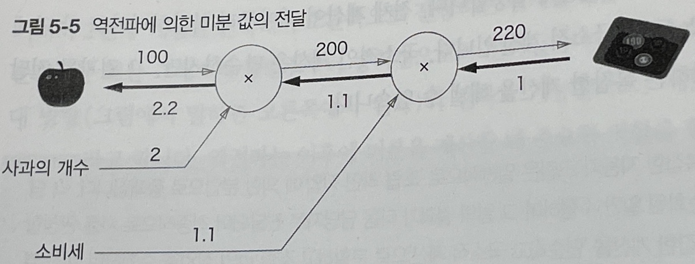
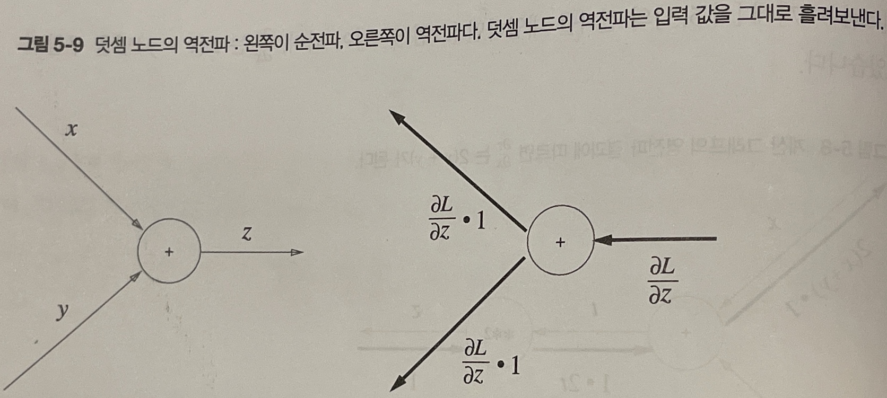
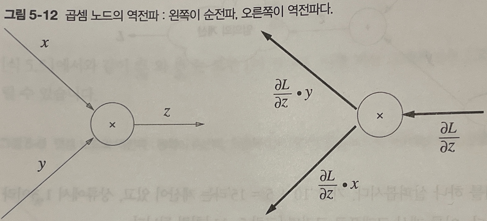
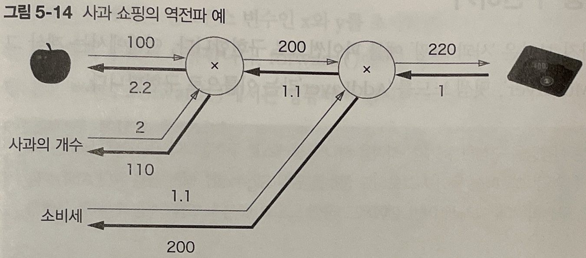
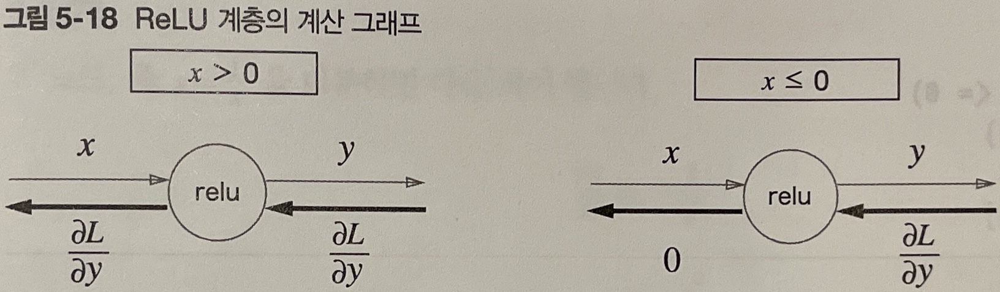
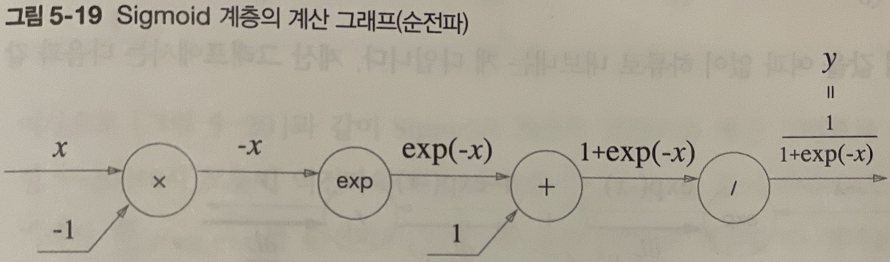
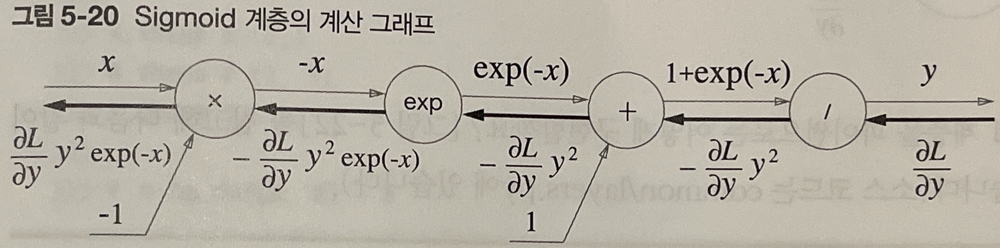
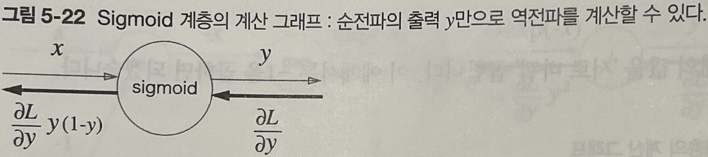

# 5장
수치 미분은 구현하기는 쉽지만 계산시간이 오래걸린다는 단점이 존재함\
오차역전파 법으로 가중치 매개변수의 기울기를 효율적으로 계산할 수 있음\
오차역전파법을 이해하는 방법으로 두가지 방법이 존재함
1. 수식을 통하여 이해하는 방법
2. 계산 그래프를 통하여 이해하는 방법
----------
## 5.1 계산 그래프
<strong>계산 그래프</strong>는 계산 과정을 그래프로 나타낸 것
- 그래프는 그래프 자료구조와 같이, 복수의 노드와 에지로 표현 됨

### 5.1.1 계산 그래프로 풀다
계산 그래프에서 '계산을 왼쪽에서 오른쪽으로 진행'하는 단계를 <strong>순전파</strong>라고함\
순전파의 반대방향인 '오른쪽에서 왼쪽으로'의 전파인 <strong>역전파</strong> 또한 존재함
### 5.1.2 국소적 계산
계산 그래프의 특징으로 '국소적 계산'을 전파함 으로써 최중 결과를 얻는다는 점이 있음\
국소적 계산이란 전체에서 어떤 일이 벌어지든 상관없이 자신과 관계된 정보만으로 결과를 출력할 수 있다는 것임

### 5.1.3 왜 계산 그패르로 푸는가?
계산 그래프를 사용했을 때의 이점이 무엇인가?
- 국소적 계산이 가능하므로, 전체가 아무리 복잡해도 각 노드에서는 단순한 계산에 집중하여 문제를 단순화할 수 있음
- 계산 그래프는 중간 계산 결과를 모두 보관할 수 있음
- 역전파를 통해 '미분'을 효율적으로 계산할 수 있음

그래프에서 역전파는 순전파와 반대방향의 화살표(굵은 선)로 그림

------------
## 5.2 연쇄법칙
### 5.2.1 계산 그래프의 역전파
역전파의 절파는 신호 E에 노드의 구소적 미분 ( $dy\over dx$ ) 을 곱한 후 다음 노드로 전달하는 것임

이러한 방식을 따르면 목표로 하는 미분 값을 효율적으로 구할 수 있다는 것이 핵심\
이것이 왜 가능한 지는 연쇄법칙의 원리로 설명할 수 있음
### 5.2.2 연쇄법칙이란?
$$
\frac{dz}{dx} = \frac{dz}{dt} \frac{dt}{dx}
$$
### 5.2.3 연쇄법칙과 계산 그래프

----------
## 5.3 역전파
### 5.3.1 덧셈 노드의 역전파
덧셈 노드의 역전파는 1을 곱하기만 할 뿐 입력된 값을 그대로 다음 노드로 보냄\
~~$ \frac{dz}{dx} = \frac{dz}{dy} = 1 $ 이기 때문임~~

### 5.3.2 곱셈 노드의 역전파
$z = xy$인 경우 $\frac{dz}{dx}=y, \frac{dz}{dy}=x$이므로

와 같이 그래프를 그릴 수 있음\
곰셉 노드 역전파는 상류의 값에 순전파 떄의 입력 신호들을 '서로 바꾼 값'을 곱해서 하류로 보냄
### 5.3.3 사과 쇼핑의 예
사과 쇼핑의 예에서 사과 가격의 미분은 2.2, 사과 개수의 미분은 110, 소비세의 미분은 200으로\
같은 크기의 변화로 최종금액에는 소비세, 사과개수, 사과 가격 순으로 큰 영향을 준다고 해석할 수 있음

------------
## 5.5 활성화 함수 계층 구현하기
### 5.5.1 ReLU 계층
활성화 함수 ReLU의 수식은 다음과 같음
$$
y= \begin{cases}
x\;(x>0)\\
0\;(x≤0)
\end{cases}
$$
따라서 $x$에 대한 $y$의 미분은 다음과 같음
$$
\frac{dy}{dx} = \begin{cases}
1\;(x>0)\\
0\;(x≤0)
\end{cases}
$$
ReLU 계층의 계산 그래프는 다음과 같이 그릴 수 있음

ReLU 계층은 스위치로 비유할 수 있음
### 5.5.2 sigmoid 계층
시그모이드 함수는 다음과 같음
$$
y=\frac{1}{1+exp(-x)}
$$
위 식을 계산 그래프로 그리면 다음과 같음

$y=\frac{1}{X}$의 미분은
$$
\begin{aligned}
dy&=-\,\frac{1}{x^2}\\
&=-\;y^2
\end{aligned}
$$
이며, $y=exp(x)$의 미분은
$$
dy=exp(x)
$$
이므로 sigmoid의 역전파를 계산 그래프로 그려보면

그런데 $\frac{dL}{dy}y^2exp(-x)$는 다음과 같이 정리된다.
$$
\begin{aligned}
\frac{dL}{dy}y^2exp(-x) &= \frac{dL}{dy}\frac{1}{(1+exp(-x))^2}exp(-x)\\
&=\frac{dL}{dy}\frac{1}{1+exp(-x)}\frac{exp(-x)}{1+exp(-x)}\\
&=\frac{dL}{dy}y(1-y)\\
\end{aligned}
$$
따라서 sigmoid 계층의 역전파는 순전파의 출력만으로 계산이 가능 함

---------
## 5.6 Affine/Softmax 계층 구현하기
### Affine 계층