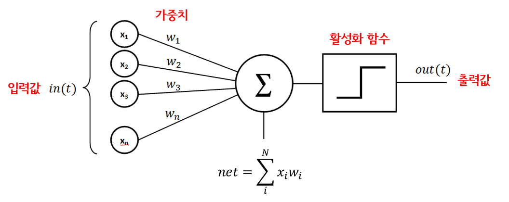

# CH2. 퍼셉트론

### 퍼셉트론이란?

- 다수의 신호를 입력으로 받아 하나의 신호를 출력한다.
- 처음 퍼셉트론의 개념에서, **파라미터(weight, bias)**를 정하는 것은 사람이다.
    - 기계학습에서는 이 파라미터의 값을 정하는 것을 자동으로 하도록 한다.
    - **학습**이란 적절한 파라미터 값을 정하는 작업이다.
    
    
    

### 단층 퍼셉트론의 한계

- **단일 퍼셉트론(선형)**을 이용하여 AND, NAND, OR 게이트를 만들 수 있다.
그러나 XOR 게이트는 만들 수 없다.
    
    
    

### 다층 퍼셉트론

- **다층퍼셉트론**을 사용하면, 비선형 영역을 표현할 수 있으므로, XOR 게이트 문제를 해결할 수 있다.
(좌측: 비선형)
    
    
    
- 다층 퍼셉트론 예시
    
    