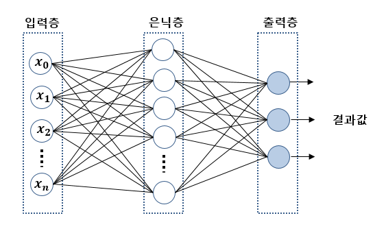

# CH3. 신경망

### 신경망이란

- **신경망**: 다층 퍼셉트론, 여러 층으로 구성되고 연속으로 매끈한 활성화 함수를 사용하는 네트워크
    - 반면, 단층 퍼셉트론은 단층 네트워크에서 계단함수를 활성화 함수로 사용한 모델을 말한다.
    - **계단함수**: 임계값을 경계로 출력이 바뀌는 함수
- 신경망 예시
    
    
    
- **편향(bias)**: 뉴런이 얼마나 쉽게 활성화되느냐를 제어한다.
- **가중치(weight)**: 뉴런이 다음 뉴런에 미칠 영향력을 제어한다.
- 편향 표현을 추가한 퍼셉트론의 표현
    - 편향의 입력신호는 언제나 1이다.
    
    
    

### 활성화 함수

- **활성화 함수(activation function)**: 조건분기의 동작을 하나의 함수로 표현
    - 입력신호의 총합이 활성화를 일으키는지 정하는 역할을 한다.
    - 예시) 0을 넘으면1을 출력하고, 그렇지 않으면 0을 출력
- 계단함수가 아닌, 시그모이드와 같이 매끈한 활성화 함수를 사용하는 것이 신경망의 포인트!
- 활성화 함수를 추가한 퍼셉트론의 표현
    
    
    

### 계단 함수와 시그모이드 함수의 차이

- 계단함수(step function)
    - 출력이 0 또는 1
    
    
    

- 시그모이드(sigmoid function)
    - 출력값이 연속
    
    
    
- 퍼셉트론(계단함수를 사용)에서는 뉴런 사이에 0과 1이 흘렀다면, 
신경망(S자 함수 사용)에서는 연속적인 실수가 흐른다.
- 시그모이드 함수는 입력이 중요하면 큰 값을 출력하고, 입력이 중요하지 않으면 작은 값을 출력
- 공통점
    - 입력의 크기와 상관없이 출력은 0에서 1 사이의 값이다.
    - 비선형함수이다.

### 비선형 함수

- 함수는 입력에 따른 출력값을 돌려주는 변환기이다. 
변환기에 무언가 입력했을 때, 출력이 입력의 상수배만큼 변하는 함수를 **선형 함수**라고 한다.
**비선형 함수**는 직선 한개로 그릴 수 없는 함수를 말한다.
- 신경망에서 활성화 함수로 비선형 함수를 사용해야한다.
    - 왜? 선형 함수를 이용하면, 신경망의 층을 깊게하는 이유가 없기 때문이다.
- 비선형 함수의 종류
    
    
    

### 출력층

- 신경망은 분류와 회귀 모두에 이용할 수 있고, 문제에 따라 출력층에서 사용하는 활성화 함수가 달라진다.
- 회귀(입력 데이터에서 연속적인 수치를 예측하는 문제) → 항등함수(입력을 그대로 출력)
- 분류(데이터가 어느 클래스에 속하느냐의 문제) → 소프트맥스(출력의 총합은 1)
- **소프트맥스**
    - 소프트맥스를 적용해도 출력이 가장 큰 뉴런의 위치는 변화하지 않는다.
    따라서, 신경망으로 분류할 때는 출력층의 소프트맥스를 생략해도 된다.(지수함수 계산 감소)
    - 주로 **추론(inference)**이 아닌, 신경망 **학습** 과정에서의 출력층에서 소프트맥스 함수를 사용한다.
        - 학습 단계에서는 훈련데이터를 사용하여 가중치 매개변수를 학습하고, 
        추론 단계에서는 학습한 매개변수를 사용하여 입력데이터를 분류한다.

### 기타 신경망을 이해하기 위한 정보들

- 순전파(forward propagation)
    - 신경망의 추론 과정을 순전파라고 한다.
- 원핫 인코딩(one-hot encoding)
    - 정이고, 나머지는 모두 0인 배열
- 정규화(normalization)
    - 데이터를 특정 범위로 변환하는 처리
    - 데이터 전체의 분포를 고려하여 전처리하는 경우가 많다.
        - 백색화(whitening): 전체 데이터를 균일하게 분포시킨다.
    - 데이터 전체 평균과 표준편차를 이용하여 데이터가 0을 중심으로 분포하도록 이동하거나 
    데이터의 확산 범위를 제한하는 정규화 등도 존재한다.
- 전처리(por-processing)
    - 신경망의 입력 데이터에 특정 변환을 가하는 것
- 배치(batch)
    - 하나로 묶은 입력 데이터
    - 배치 처리는 연산 시에 큰 이점을 준다.
        - 수치 계산 라이브러리 대부분이 큰 배열을 효율적으로 처리할 수 있도록 고도로 최적화 되어있다.
        - 큰 신경망에서 데이터 전송이 벽목으로 작용하는 경우가 자주 있는데, 배치 처리를 통해 버스의 부하를 절감시켜준다. → 느린 I/O를 통해 데이터를 읽는 횟수가 줄어, 빠른 연산장치를 통해 순수하게 계산하는 비율이 높아진다.