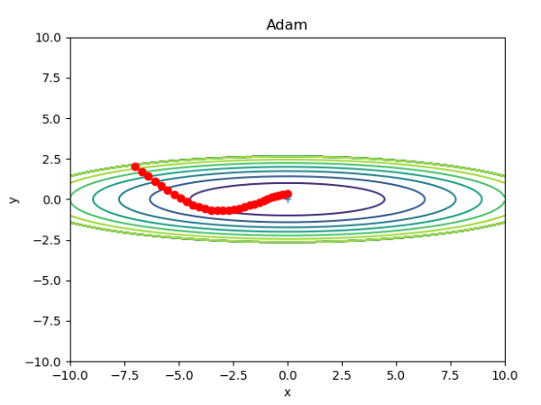

# Chapter6. 학습 관련 기술들
## 6.1 매개변수 갱신
* 신경망 학습의 목적은 손실 함수의 값을 가능한 한 낮추는 매개변수를 찾는 것
    * 신경망 최적화
    * 확률적 경사 하강법(SGD) 이용

### 6.1.1 모험가 이야기
### 6.1.2 확률적 경사 하강법(SGD)
$W \larr W-\eta \frac{\partial L}{\partial W}$   
* W : 갱신할 가중치 매개변수
* $\frac{\partial L}{\partial W}$ : W에 대한 손실 함수의 기울기
* $\eta$ : 학습률
* $\larr$ : 우변의 값으로 좌변의 값을 갱신

```Python
class SGD:
    def __init__(self, lr=0.01):
        self.lr = lr
    
    def update(self, params, grads):
        for key in params.keys():
            params[key] -= self.lr * grads[key]
```
### 6.1.3 SGD의 단점
* SGD는 비등방성 함수(방향에 따라 기울기가 달라지는 함수)에서는 탐색경로가 비효율적이다.   
* $f(x,y)=\frac{1}{20}x^2+y^2$의 최적화 경로


### 6.1.4 모멘텀
* 모멘텀은 운동량을 뜻함  
$v \larr \alpha v - \eta \frac{\partial L}{\partial W}$  
$W \larr W+v$
* W : 갱신할 가중치 매개변수
* $\frac{\partial L}{\partial W}$ : W에 대한 손실 함수의 기울기
* $\eta$ : 학습률
* v : 속도(velocity)
* 위의 식은 기울기 방향으로 힘을 받아 물체가 가속된다는 물리 법칙을 나타낸다
    * $\alpha v$ 항은 물체가 아무런 힘을 받지 않을 때 서서히 하강시키는 역할, 물리에서의 지면 마찰이나 공기저항에 해당

```Python
class Momentum:
    def __init__(self, lr=0.01, momentum=0.9):
        self.lr = lr
        self.momentum = momentum
        self.v = None
    
    def update(self, params, grads):
        if self.v is None:
            self.v = {}
            for key, val in params.items():
                self.v[key] = np.zeros_like(val)

        for key in params.keys():
            self.v[key] = self.momentum*self.v[key] - self.lr*grads[key]
            params[key] += self.v[key]
```

* SGD와 비교해서 지그재그 정도가 덜함

### 6.1.5 AdaGrad
* 신경망 학습에서는 학습률 $\eta$ 값이 중요하다.
    * 너무 작으면 시간이 길어지고 크면 발산하여 학습이 이루어지지 않음
    * `학습률 감소` : 학습을 진행하면서 학습률을 점차 줄여가는 방법

* AdaGrad는 각각의 매개변수에 맞춤형 값을 만들어준다.   
$h \larr h+ \frac{\partial L}{\partial W} \odot \frac{\partial L}{\partial W}$   
$W \larr W-\eta \frac{1}{\sqrt h}\frac{\partial L}{\partial W}$
* W : 갱신할 가중치 매개변수
* $\frac{\partial L}{\partial W}$ : W에 대한 손실 함수의 기울기
* $\eta$ : 학습률
* h : 기존 기울기의 값을 제곱하여 계속 더해줌
    * 매개변수 갱신 시 $\frac{1}{\sqrt h}$를 곱해 학습률 조정
    * 많이 움직인 매개변수는 학습률이 낮아진다.
```Python
class AdaGrad:
    def __init__(self, lr=0.01):
        self.lr = lr
        self.h = None

    def update(self, params, grads):
        if self.h is None:
            self.h = {}
            for key, val in params.items():
                self.h[key] = np.zeros_like(val)
        
        for key in params.keys():
            self.h[key] += grads[key] * grads[key]
            params[key] -= self.lr * grads[key] / (np.sqrt(self.h[key]) + 1e-7) # devide by zero 방지
```

* 최솟값을 향해 효율적으로 움직이는 것을 알 수 있다.

### 6.1.6 Adam
* 모멘텀과 AdaGrad를 융합한 방법


### 6.1.7 어느 갱신 방법을 이용할 것인가?
* 각자 장단이 있어 잘 푸는 문제와 그렇지 않은 문제가 있다.
* 상황을 고려해 여러 가지로 시도해볼것

### 6.1.8 MNIST 데이터셋으로 본 갱신 방법 비교

* SGD가 가장 느림
* 하이퍼파라미터인 학습률과 신경망의 구조에 따라 결과가 달라짐

## 6.2 가중치의 초깃값
### 6.2.1 초깃값을 0으로 하면?
* 가중치 감소는 가중치 매개변수의 값이 작아지도록 학습하는 방법
    * 가중치 값을 작게하여 오버피팅이 일어나지 않게 함
* 가중치의 초깃값을 모두 0으로 설정한다면?
    * 오차역전파법에서 모든 가중치의 값이 똑같이 갱신되므로 옳지 않은 방법
    * 0뿐만 아니라 가중치를 모두 균일한 값으로 설정해서는 안된다.

### 6.2.2 은닉층의 활성화값 분포
* 은닉층의 활성화값의 분포를 관찰하면 중요한 정보를 얻을 수 있다
* 가중치의 초깃값에 따라 은닉층의 활성화 값들이 어떻게 변화하는지 관찰
* 가중치를 표준편차가 1인 정규분포를 이용하면 각 층의 활성화 값들이 0과 1에 치우쳐 분포되어 있다.
    * 데이터가 0과 1에 치우쳐 분포하게 되면 역전파의 기울기 값이 점점 작아지다가 사라짐 $\rarr$ `기울기 소실`
* 가중치의 표준편차가 0.01인 정규분포를 이용하면 활성화 값들이 0.5 부근에 집중되어 있다. $\rarr$ `표현력을 제한한다.`
* `Xavier 초깃값` : 앞 계층의 노드가 n개라면 표준편차가 $\frac{1}{\sqrt n}$인 분포를 사용

### 6.2.3 ReLu를 사용할 때의 가중치 초깃값
* Xavier 초깃값은 활성화 함수가 선형인 것을 전제로 함
    * sigmoid나 tanh함수는 좌우 대칭이라 중앙 부근이 선형인 함수로 본다.
* `He 초깃값`: 앞 층의 노드가 n개일 때 표준편차가 $\sqrt \frac{2}{n}$인 정규분포 사용
    * ReLU 함수는 음의 영역이 0이라서 더 넓게 분포시키기 위해 2배의 계수가 필요
* 활성화 함수로 ReLU를 사용할 때는 He 초깃값을, sigmoid나 tanh 등의 S자 모양 곡선일 때는 Xavier 초깃값을 사용

### 6.2.4 MNIST 데이터셋으로 본 가중치 초깃값 비교

* std = 0.01일 때는 학습이 전혀 이뤄지지 않음
* 가중치 초깃값에 따라 신경망 학습의 성패가 갈리는 경우가 많다.

## 6.3 배치 정규화
* 배치 정규화 : 각 층에서의 활성화값이 적당히 분포되도록 조정하는 것
### 6.3.1 배치 정규화 알고리즘
* 배치 정규화가 주목받는 이유
    * 학습을 빨리 진행할 수 있다(학습 속도 개선).
    * 초깃값에 크게 의존하지 않는다(골치 아픈 초깃값 선택 장애여 안녕!).
    * 오비퍼팅을 억제한다(드롭아웃 등의 필요성 감소).
* 배치 정규화 계층을 신경망에 삽입

* $\mu_b \larr \frac{1}{m}\displaystyle \sum_{i=1}^m x_i$   
* $\sigma_B^2 \larr \frac{1}{m}\displaystyle \sum_{i=1}^m (x_i-\mu_B)^2$   
* $\hat x_i \larr \frac{x_i-\mu_B}{\sqrt {\sigma_B^2+\epsilon}}$   
    * 미니배치 $B=\{x_1, x_2, ..., x_m\}$이라는 m개의 입력 데이터의 집합에 대해 평균 $\mu_b$와 분산 $\sigma_B^2$
    * 입력 데이터를 평균이 0, 분산이 1이되게 정규화
    * $\epsilon$ 기호는 작은 값으로, 0으로 나누는 사태 예방
    * 배치 정규화 계층마다 이 정규화 된 데이터에 고유한 확대와 이동 변환을 수행
    * $y_i \larr \gamma \hat x_i+\beta$
        * $\gamma$ 가 확대를, $\beta$ 가 이동을 담당.
        * 처음에는 $\gamma=1, \beta=0 부터시작하고, 학습하면서 적합한 값으로 조정

### 6.3.2 배치 정규화의 효과

* 배치 정규화를 사용할 때 학습속도가 훨씬 빠르다.

## 6.4 바른 학습을 위해
* 오버피팅 : 신경망이 훈련 데이터에만 지나치게 적응되어 그 외의 데이터에는 제대로 대응하지 못하는 상태

### 6.4.1 오버피팅
* 오버피팅은 주로 다음의 두 경우에 일어난다.
    * 매개변수가 많고 표현력이 높은 모델
    * 훈련 데이터가 적음 


* 60000개의 훈련 데이터중 300개만 사용, 7층 네트워크 사용
* 훈련 데이터의 정확도는 100에폭을 지나느 무렵부터 거의 100%
* 시험데이터에 대해서는 큰 차이를 보임

### 6.4.2 가중치 감소
* `가중치 감소` : 학습 과정에서 큰 가중치에 대해서는 그에 상응하는 큰 페널티를 부과하여 오버피팅을 억제하는 방법
* L2 노름을 손실 함수에 더한다 

    * 신경망 학습의 목적은 손실 함수의 값을 줄이는 것 이기때문에 L2 노름을 더해 손실 함수의 값이 커진다면 그만큼 가중치가 커지는 것을 억제할 수 있다.
    * 가중치가 W라 하면 L2 노름에 따른 가중치 감소는 $\frac{1}{2}\lambda W^2$
    * $\lambda$ 는 정규화의 세기를 조절하는 하이퍼파라미터, 크게 할수록 페널티가 커짐


* 훈련 데이터와 시험 데이터에 대한 정확도 차이가 줄어들음
* 오버피팅이 억제됨

### 6.4.3 드롭아웃
* 가중치 감소는 간단하게 구현할 수 있고 어느 정도 지나친 학습을 억제 할 수있다. 그러나 신경망 모델이 복잡해지면 가중치 감소로는 대응하기 힘들다.
* `드롭아웃` : 뉴런을 임의로 삭제하면서 학습하는 방법
* 훈련 때는 데이터를 흘릴 때마다 삭제할 뉴런을 무작위로 선택
* 시험 때는 모든 뉴런에 신호를 전달하고 각 뉴런의 출력에 훈련 때 삭제 안 한 비율을 곱하여 출력
```Python
class Dropout:
    def __init__(self, dropout_ratio=0.5):
        self.dropout_ratio = dropout_ratio
        self.mask = None
    
    def forward(self, x, train_flg=True):
        if train_flg:
            self.mask = np.random.rand(*x.shape) > self.dropout_ratio
            return x*self.mask
        else:
            return x*(1.0 - self.dropout_ratio)
    
    def backward(self, dout):
        return dout*self.mask
```

* 훈련 데이터와 시험 데이터에 대한 정확도 차이가 줄어들음
* 표현력을 높이면서도 오버피팅을 억제할 수 있음

## 6.5 적절한 하이퍼파라미터 값 찾기
### 6.5.1 검증 데이터
* 하이퍼파라미터를 검증할 때는 시험 데이터를 사용하면 안된다.
    * 오버피팅 되기 때문
* `검증 데이터` : 하이퍼파라미터 조정용 데이터
* 훈련 데이터, 검증 데이터, 시험 데이터로 분리

### 6.5.2 하이퍼파라미터 최적화
* 하이퍼파라미터의 최적 값이 존재하느 범위를 조금씩 줄여간다.
* 하이퍼파라미터의 범위는 대략적으로 지정하는 것이 효과적
* 딥러닝 학습에는 오랜 시간이 걸리기 때문에 에폭을 작게하여 1회 평가에 걸리는 시간을 단축하는게 효과적
* 하이퍼파라미터 최적화 단계
    * 하이퍼파라미터 값의 범위 설정
    * 설정된 범위에서 하이퍼파라미터의 값을 무작위로 추출
    *샘플링한 하이퍼파라미터 값을 사용하여 학습하고 검증데이터로 정확도를 평가(에폭은 작게 설정)
    * 1단계와 2단계를 특정 횟수(100회 등) 반복하며 그 정확도의 결과를 보고 하이퍼파라미터의 범위를 좁힘

### 6.5.3 하이퍼파라미터 최적화 구현하기

## 6.6 정리
* 매개변수 갱신 방법에는 확률적 경사 하강법(SGD) 외에도 모멘텀, AdaGrad, Adam 등이 있다.
* 가중치 초깃값을 정하는 방법은 올바른 학습을 하는 데 매우 중요하다.
* 가중치의 초깃값으로는 'Xavier 초깃값'과 'He 초깃값'이 효과적이다.
* 배치 정규화를 이용하면 학습을 빠르게 진행할 수 있으며, 초깃값에 영향을 덜 받게 된다.
* 오버피팅을 억제하는 정규화 기술로는 가중치 감소와 드롭아웃이 있다.
* 하이퍼파라미터 값 탐색은 최적 값이 존재할 법한 범위를 점차 좁히면서 하는 것이 효과적이다.

