# Chapter7 합성곱 신경망(CNN)
convolutional neural network
## 7.1 전체 구조
* CNN도 계층을 조합하여 만들 수 있다.
    * 합성곱 계층과 풀링 계층  
  
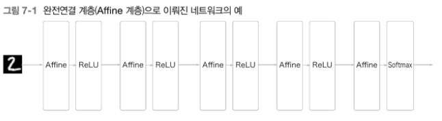
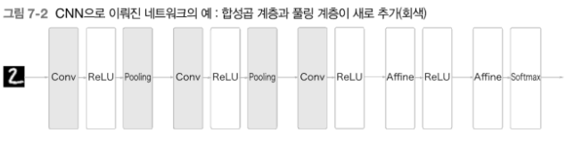
* Affine-ReLU 연결이 Conv-ReLU-Pooling으로 바뀜

## 7.2 합성곱 계층
### 7.2.1 완전연결 계층의 문제점
* 완전연결 계층(Affine 계층)의 문제점은 데이터의 형상이 무시된다는 것
    * 예를 들어 입력 데이터가 이미지 일 때 3차원 데이터인 이미지를 1차원 데이터로 평탄화해줘야 한다.
    * 이미지라는 3차원 데이터가 가지는 공간적 정보에 대해서는 무시
* CNN에서의 입력 데이터는 입력 특징 맵, 출력 데이터는 출력 특징 맵

### 7.2.2 합성곱 연산
* 합성곱 계층에서의 합성곱 연산, 이미지 처리에서 말하는 필터 연산
* 입력 데이터는 세로-가로 방향의 형상을 가졌고, 필터 역시 세로-가로 바향의 차원을 갖느다.
* 데이터와 필터의 형상을 (높이,너비)로 표기한다.
* 필터를 커널이라고 칭하기도 한다.
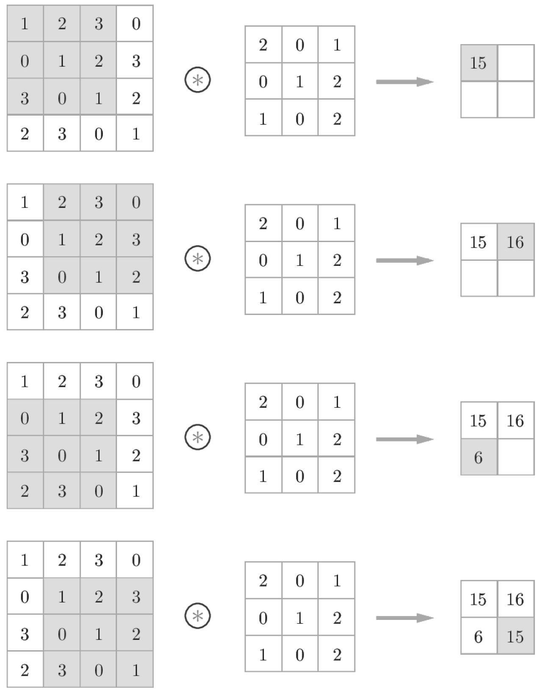
* 합성곱 연산은 필터의 윈도우(그림의 회색 부분)를 일정간격으로 이동해가며 입력데이터에 적용한다.
* 입력과 필터에서 대응하는 원소끼리 곱한 후 그 총합을 구한다.(단일 곱셈-누산)
* 편향은 필터를 적용한 후 데이터의 모든 원소에 합산

### 7.2.3 패딩
* 패딩 : 합성곱 연산을 수행하기 전에 입력 데이터 주변을 특정 값(예컨대 0)으로 채우는 것
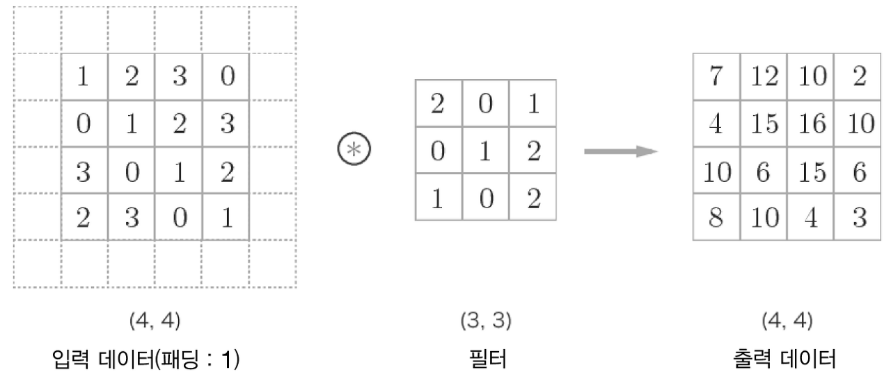
* 출력 크기를 조정할 목적으로 사용

### 7.2.4 스트라이드
* 스트라이드 : 필터를 적용하는 위치의 간격
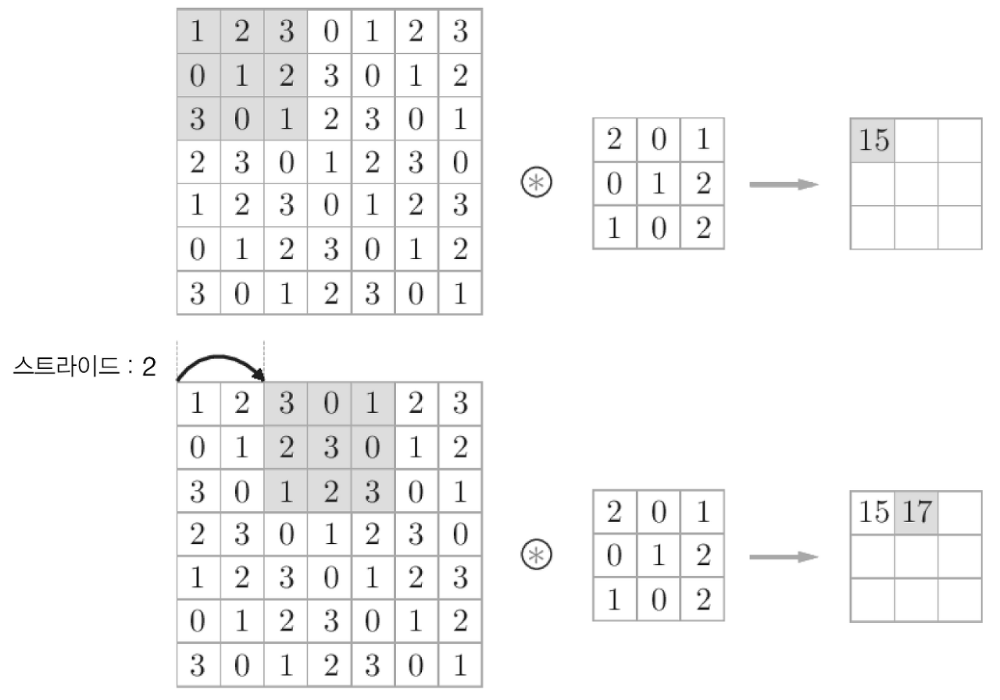
* 스트라이드를 2로 하면 윈도우가 두 칸씩 이동
* 입력 크기를 (H,W) 필터 크기를 (FH, FW) 출력 크기를 (OH, OW) 패딩을 P 스트라이드를 S
* $OH=\frac{H+2P-FH}{S}+1$
* $OW=\frac{W+2P-FW}{S}+1$
* 수식이 정수로 나눠떨어지는 값이어야 한다.

### 7.2.5 3차원 데이터의 합성곱 연산
* 3차원 데이터는 세로 가로에 이어 채널방향 까지 고려
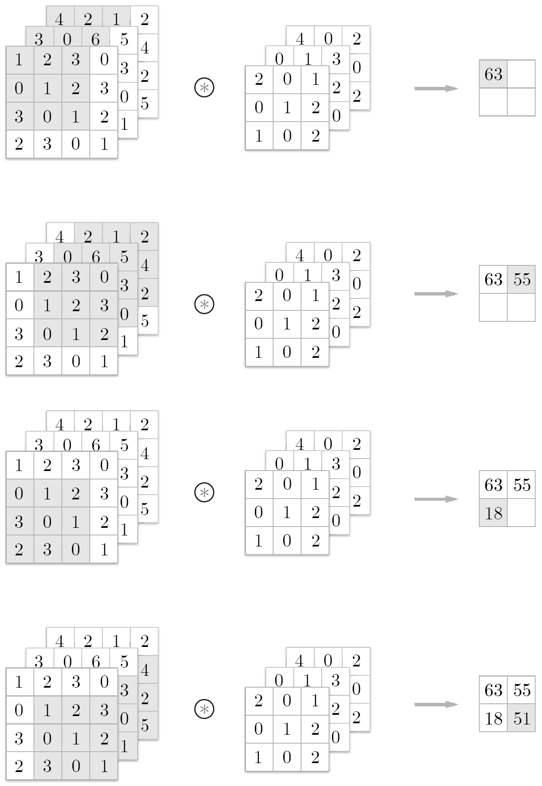
* 입력 데이터와 필터의 합성곱 연산을 채널마다 수행하고 그 결과를 더해서 하나의 출력을 얻음
* 입력 데이터의 채널 수와 필터의 채널 수가 같아야 한다.
* 모든 채널의 필터가 같은 크기여야 한다.

### 7.2.6 블록으로 생각하기
* 데이터와 필터를 직육면체 블록이라 생각하면 쉽다.
* 3차원 데이터 (C,H,W) 3차원 필터 (C,FH,FW)
* 필터를 여러개 사용하면 출력도 블록이 된다.
* 이처럼 합성곱 연산에서는 필터의 수도 고려해야한다.
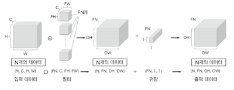
* 편향의 수도 필터의 수와 같이 FN

### 7.2.7 배치 처리
* 다른 신경망 처리와 같이 합성곱 연산도 배치 처리
* 데이터의 차원을 하나 늘려 4차원 데이터로 저장 (데이터 수, 채널 수, 높이, 너비)
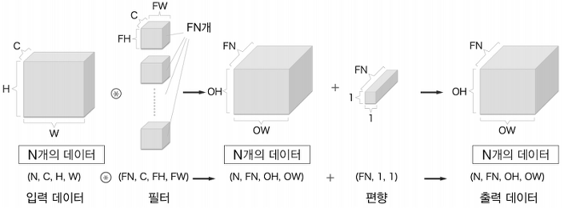

## 7.3 풀링 계층
* 풀링 : 세로-가로 방향의 공간을 줄이는 연산
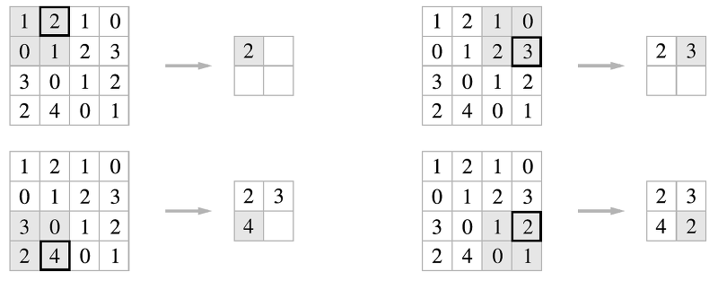
* 최대 풀링 : 영역에서 가장 큰 원소를 하나 꺼냄
* 풀링의 윈도우 크기와 스트라이드는 같은 값으로 설정

### 7.3.1 풀링 계층의 특징
* 학습해야 할 매개변수가 없다
* 채널 수가 변하지 않는다
* 입력의 변화에 영향을 적게 받는다(강건하다)

## 7.4 합성곱/풀링 계층 구현하기
### 7.4.1 4차원 배열
* (데이터의 개수, 채널 수, 높이, 너비)

### 7.4.2 im2col로 데이터 전개하기
* 4차원 배열에 대한 합성곱 연산을 구현하려고 for문을 쓰는 것은 비효율적이다.
* im2col이라는 편의함수를 사용해 해결가능
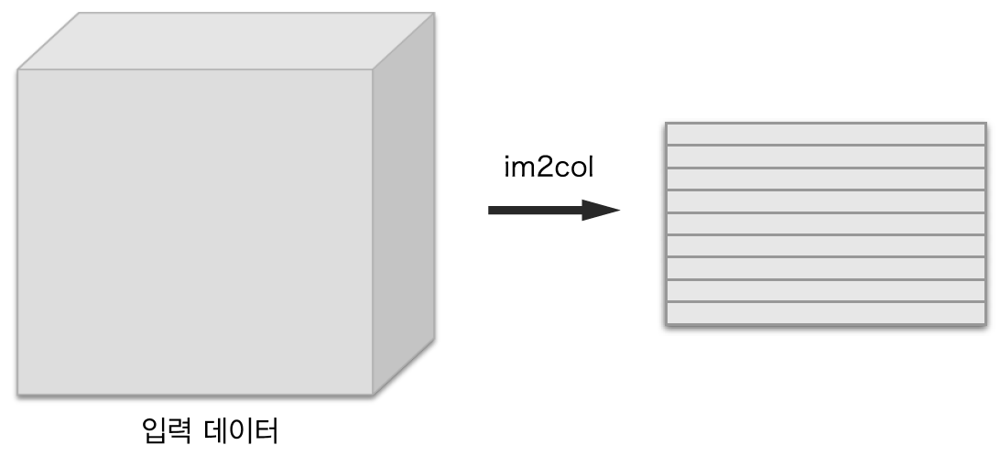
* 3차원 데이터를 2차원 행렬로 전개
* im2col으로 데이터를 필터의 적용 영역마다 전개하면 원래 블록의 원소 수 보다 많아진다.
* 입력 데이터를 im2col로 전개하고 필터를 1열로 전개한 뒤 행렬의 곱을 계산하는 방법이 효율적이다.
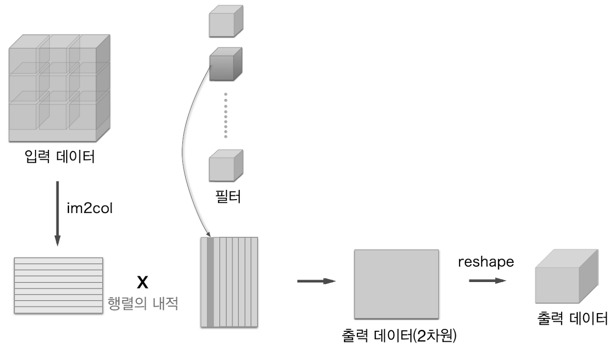

### 7.4.3 합성곱 계층 구현하기
```Python
im2col(input_data, filter_h, filter_w, stride=1, pad=0)
```
* input_data - (데이터 수, 채널 수, 높이, 너비)의 4차원 배열로 이루어진 입력 데이터
* filter_h - 필터의 높이
* filter_w - 필터의 너비
* stride - 스트라이드
* pad - 패딩

```Python
class Convolution:
    def __init__(self, W, b, stride=1, pad=0):
        self.W = W
        self.b = b
        self.stride = stride
        self.pad = pad
    
    def forward(self, x):
        FN, C, FH, FW = self.W.shape
        N, C, H, W = x.shape
        out_h = int(1 + (H + 2*self.pad - FH) / self.stride)
        out_w = int(1 + (W + 2*self.pad - FW) / self.stride)

        col = im2col(x, FH, FW, self.stride, self.pad)
        col_W = self.W.reshape(FN, -1).T # 필터 전개
        out = np.dot(col, col_W) + self.b

        out = out.reshape(N, out_h, out_w, -1).transpose(0, 3, 1, 2)
        
        return out
```

### 7.4.4 풀링 계층 구현하기
* 풀링은 채널 쪽이 독립적이다.
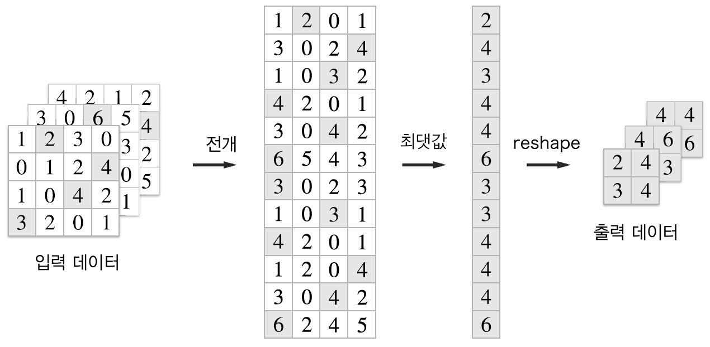
```Python
class Pooling:
    def __init__(self, pool_h, pool_w, stride=1, pad=0):
        self.pool_h = pool_h
        self.pool_w = pool_w
        self.stride = stride
        self.pad = pad
    
    def forward(self, x):
        N, C, H, W = x.shape
        out_h = int(1 + (H - self.pool_h) / self.stride)
        out_w = int(1 + (W - self.pool_w) / self.stride)

        # 전개 
        col = im2col(x, self.pool_h, self.pool_w, self.stride, self.pad)
        col = col.reshape(-1, self.pool_h*self.pool_w)

        # 최댓값
        out = np.max(col, axis=1)

        # 성형
        out = out.reshape(N, out_h, out_w, C).transpose(0, 3, 1, 2)

        return out
```

## 7.5 CNN 구현하기
* 초기화(__init__)의 인수
    * input_dim - 입력 데이터(채널 수, 높이, 너비)의 차원
    * conv_param - 합성곱 계층의 하이퍼파라미터(딕셔너리)
        - filter_num - 필터수
        - filter_size - 필터 크기
        - stride - 스트라이드
        - pad - 패딩
    * hidden_size - 은닉층(완전연결)의 뉴런 수
    * output_size - 출력층(완전연결)의 뉴런 수
    * weight_init_std - 초기화 때의 가중치 표준편차

```Python
class SimpleConvNet:
    def __init__(self, input_dim=(1,28,28), conv_param={'filter_num':30, 'filter_size':5, 'pad':0, 'stride':1}, hidden_size=100, output_size=10, weight_init_std=0.01):
        # 초기화 인수로 주어진 합성곱 계층의 하이퍼파라미터를 딕셔너리에서 꺼냄
        filter_num = conv_param['filter_num']
        filter_size = conv_param['filter_size']
        filter_pad = conv_param['pad']
        filter_stride = conv_param['stride']
        input_size = input_dim[1]
        conv_output_size = (input_size - filter_size + 2*filter_pad) / filter_stride + 1
        pool_output_size = int(filter_num*(conv_output_size/2) * (conv_output_size/2))

        # 가중치 매개변수 초기화
        self.params = {}
        self.params['W1'] = weight_init_std * np.random.randn(filter_num, input_dim[0], filter_size, filter_size)
        self.params['b1'] = np.zeros(filter_num)
        self.params['W2'] = weight_init_std * np.random.randn(pool_output_size, hidden_size)
        self.params['b2'] = np.zeros(hidden_size)
        self.params['W3'] = weight_init_std * np.random.randn(hidden_size, output_size)
        self.params['b3'] = np.zeros(output_size)

        # CNN을 구성하는 계층들을 생성
        self.layers = OrderedDict()
        self.layers['Conv1'] = Convolution(self.params['W1'], self.params['b1'], conv_param['stride'], conv_param['pad'])
        self.layers['Relu1'] = Relu()
        self.layers['Pool1'] = Pooling(pool_h=2, pool_w=2, stride=2)
        self.layers['Affine1'] = Affine(self.params['W2'], self.params['b2'])
        self.layers['Relu2'] = Relu()
        self.layers['Affine2'] = Affine(self.params['W3'], self.params['b3'])

        self.last_layer = SoftmaxWithLoss()
    
    def predict(self, x):
        for layer in self.layers.values():
            x = layer.forward(x)
        return x

    def loss(self, x, t):
        y = self.predict(x)
        return self.last_layer.forward(y, t)

    def gradient(self, x, t):
        self.loss(x, t)

        dout = 1
        dout = self.last_layer.backward(dout)
        layers = list(self.layers.values())
        layers.reverse()
        for layer in layers:
            dout = layer.backward(dout)

        grads = {}
        grads['W1'] = self.layers['Conv1'].dW
        grads['b1'] = self.layers['Conv1'].db
        grads['W2'] = self.layers['Affine1'].dW
        grads['b2'] = self.layers['Affine1'].db
        grads['W3'] = self.layers['Affine2'].dW
        grads['b3'] = self.layers['Affine2'].db

        return grads
```

## 7.6 CNN 시각화하기
### 7.6.1 1번째 층의 가중치 시각화하기
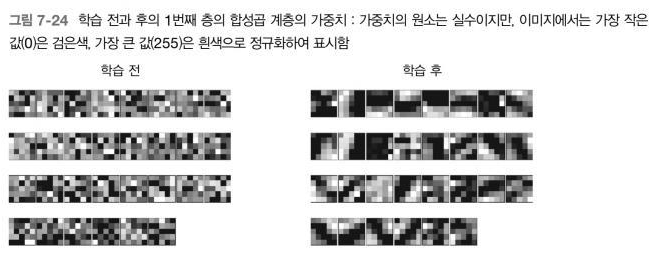
* 학습 전 필터는 무작위로 초기화되고 있어 흑백의 정도에 규칙성이 없다.
* 학습 후 필터는 흰색에서 검은색으로 점차 변화하는 필터와 덩어리가 진 필터등 규칙을 띄는 필터로 바뀌었다.
* 합성곱 계층의 필터는 에지나 블롭 등의 원시적인 정보를 추출할 수 있다.

### 7.6.2 층 깊이에 따른 추출 정보 변화
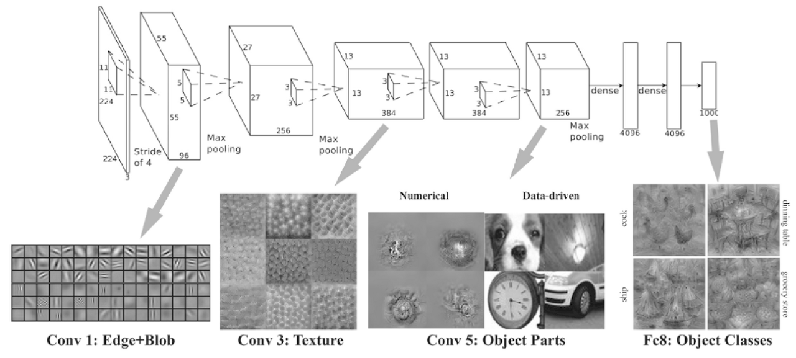
* 계층이 깊어질수록 추출되는 정보는 더 추상화된다.
* 층이 깊어지면서 뉴런이 반응하는 대상이 단순한 모양에서 고급정보로 변화해간다. 다시 말해 사물의 의미를 이해하도록 변화한다.

## 7.7 대표적인 CNN
### 7.7.1 LeNet
* 손글씨 숫자를 인식하는 네트워크
* 시그모이드 함수를 사용
* 풀링이 아니라 단순히 원소줄이기를 위한 서브샘플링 사용

### 7.7.2 AlexNet
* 활성화 함수로 ReLU를 이용
* LRN이라는 국소적 정규화를 실시하는 계층을 이용
* 드롭아웃을 사용

## 7.8 정리
* CNN은 지금까지의 완전연결 계층 네트워크에 합성곱 계층과 풀링 계층을 새로 추가한다.
* 합성곱 계층과 풀링 계층은 im2col(이미지를 행렬로 전개하는 함수)을 이용하면 간단하고 효율적으로 구현할 수 있다.
* CNN을 시각화해보면 계층이 깊어질수록 고급 정보가 추출되는 모습을 확인할 수 있다.
* 대표적인 CNN에는 LeNet과 AlexNet이 있다.
* 딥러닝의 발전에는 빅데이터와 GPU가 크게 기여했다.